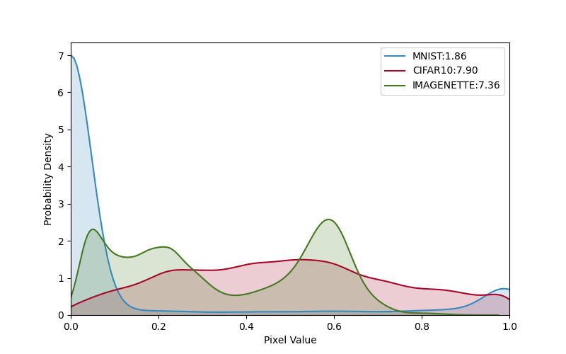
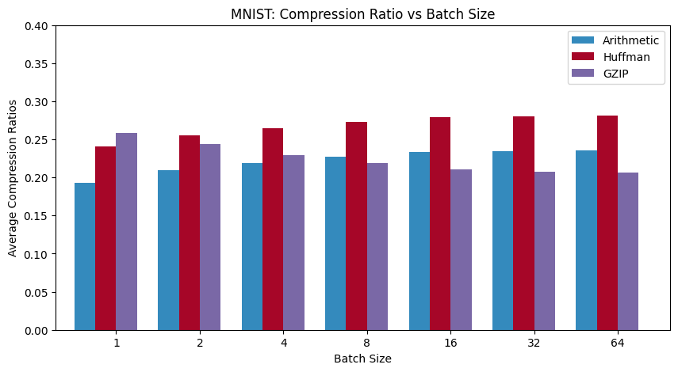
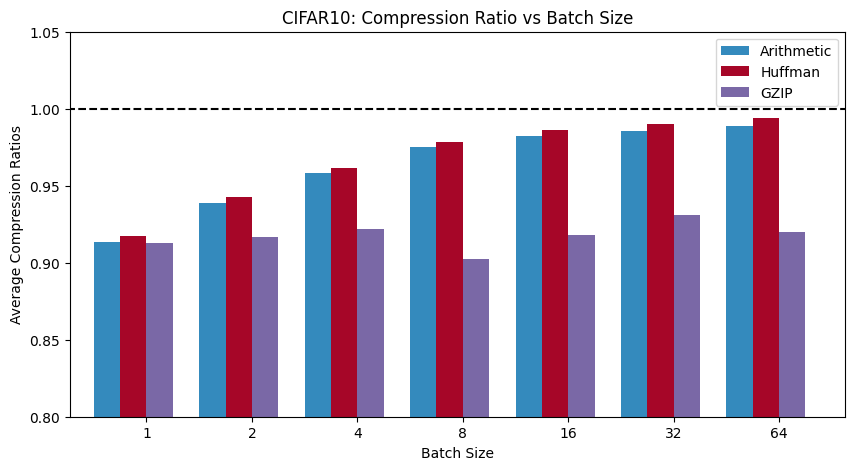
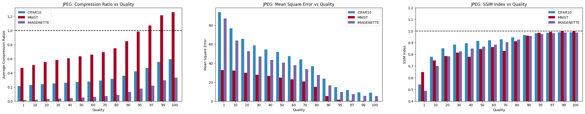
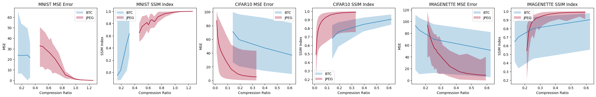
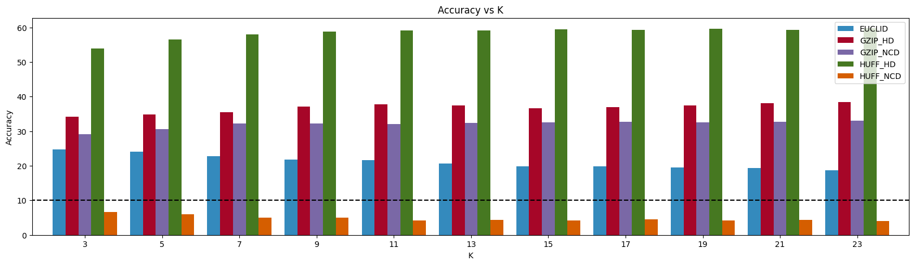

# Kolmogorov Complexity-based Parameter Free Image Classification

Compression techniques are of significant importance in any domain, including applications in data processing, storage, and analysis. Images are ubiquitous as a data format, making image compression methods vital for any tasks involving large datasets. Image Compression techniques are broadly classified as lossy and lossless compression techniques. This study compares a few of these image compression techniques and analyses their performance using compression ratios and quality assessment metrics. Further, a notion of distance is defined using Hamming distance and the Kolmogorov Complexity between the compressed binary strings, which helps perform K-Nearest Neighbour clustering on lossless compressed images. 

## Running code

### KNN Classification using different distance metrics
For getting accuracy of KNN classification using different distance metrics, run the following command:

```
python main.py --dataset=MNIST --distance_metric=EUCLID --k=5 7 
```

Datasets available are MNIST, CIFAR10 and IMAGENETTE (a subset of the ImageNet dataset).

Distance metrics available are Euclidean distance and a few compression based distances:

    - GZIP compression 
        - Hamming distance
        - Kolmogorov Complexity
    - Huffman compression
        - Hamming distance
        - Kolmogorov Complexity

### Compression Ratio and Quality Assessment for different compression techniques
For getting compression ratio and quality assessment for different compression techniques, run the following command:

```
python main.py --dataset=MNIST --compression_technique=gzip
```

Compression techniques available:

    - Arithmetic Compression
    - Block Truncation Compression
    - GZIP Compression
    - Huffman Compression
    - JPEG Compression

Further, one can also specify the hyperparameters for the compression techniques using similar commandline arguments.

## Results
<figure>
  
  <figcaption>The graph represents the probability distribution of normalized pixel values within the image dataset. It is derived by extending the discrete distribution to a continuous distribution using a kernel density estimator, which provides a comprehensive view of the image dataset's overall distribution and composition.</figcaption>
</figure>

<figure>
   
  <figcaption>The graphs depict the average compression ratios achieved by the encoding schemes (Arithmetic, Huffman, and GZIP) on the
MNIST and CIFAR10 datasets respectively across varying batch sizes</figcaption>
</figure>


<figure>
  
  <figcaption>Different metrics of JPEG compression are analyzed against the quality setting in this figure. (a) IMAGENETTE achieves the best compression ratios for all quality settings followed by CIFAR10. (b) MNIST maintains the lowest MSE among the datasets across the entire quality range. (c) The SSIM values converge ∼ 1 for all three datasets, signifying high perceptual similarity at higher-quality settings.</figcaption>
</figure>

<figure>
  
  <figcaption>The image presents a comparative analysis of compression performance for three different image datasets, MNIST, CIFAR10, and IMAGENETTE, using BTC and JPEG compression for various compression ratios.</figcaption>
</figure>

<figure>
  
  <figcaption>The graph depicts the accuracy of a K-Nearest Neighbors (KNN) model for various values of K. The different bars in the graph correspond to different distance metrics (EUCLID, GZIP HD, etc.) and compression techniques (NCD, HD) used. </figcaption>
</figure>